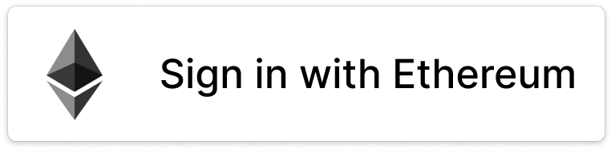

# Sign-In with Ethereum Brand Assets
The Sign-In with Ethereum brand assets include the logo, logomark, and icons associated with the project. 

All of the assets in this directory are being released under a CC0 1.0 license (see: [license.md](License.md) in this directory) for the public to use and incorporate them where they wish to. 

## Sign-In with Ethereum Buttons

For those incorporating Sign-In with Ethereum into their project and require a button for users, we have included two as part of this asset set, covering both a light and dark background:

These buttons have also been made into Figma components and can be found [here](https://www.figma.com/community/file/1047625951123719630).

Some additional creative designs have been provided by `Cousin Eddie#5625` in the Spruce Discord server with confirmation of a CC0 waiver. Those examples can be found [here](https://www.figma.com/file/UUqhgK03wwVxiKjzw90Nuh/Sign-In-With-Ethereum---Button-Designs?node-id=0%3A1).