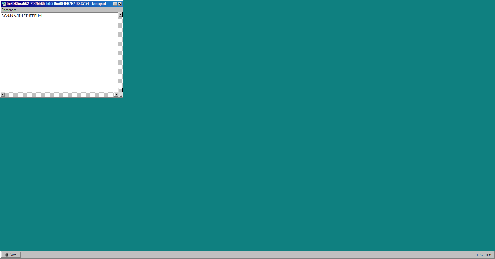

# Sign-In with Ethereum Notepad Example
Example usage of the Sign-In with Ethereum (SIWE) library

# Running
At the top of the `src/index.ts` file there is a variable that is the default port
used. If you want to use the provided Infura ID, select one of the following ports: 
`3000`,`3010`,`4000`,`4010`,`4361`,`9080`. Otherwise you'll be unable to connect 
to Infura.

## Quickstart
```bash
npm i
npm run dev
```

## Play around
Open your browser at `http://localhost:4361` and have fun!

Select one of the providers available (Metamask, WalletConnect) to begin a SIWE-based
session. Write anything you want and hit the "Save" button (you can also use Cmd+s/Ctrl+s to save). You can refresh the page or close your tab -  just don't delete your session cookie and your text will continue to be there until you decide to delete the folder `/db`, where sessions are stored.


